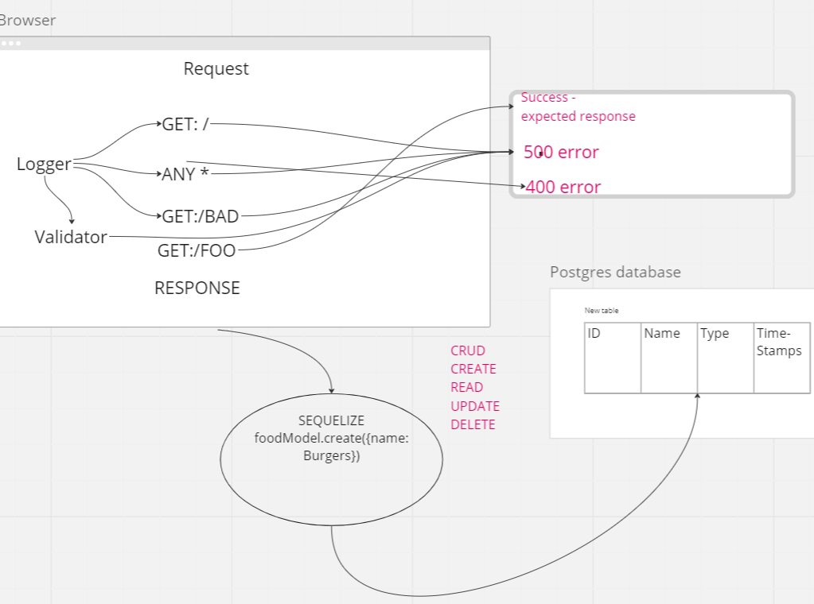

# LAB - Class 03

## Project: basic-api-server

### Author: Rafael Aldana

### Problem Domain

Build a REST API using Express, by creating a proper series of endpoints that perform CRUD operations on a database, using the REST standard.

### Links and Resources

- [GitHub Actions ci/cd](https://github.com/Rafael-Aldana/basic-api-server/actions/new)
- [back-end server dev url](https://github.com/Rafael-Aldana/basic-api-server/tree/dev)
- [back-end server prod url](https://github.com/Rafael-Aldana/basic-api-server/tree/main)

### Setup

#### `.env` requirements (where applicable)

DATABASE_URL

#### How to initialize/run your application (where applicable)

- e.g. `npm start` `nodemon`

#### How to use your library (where applicable)

#### Features / Routes

- Feature One: deploy Dev

#### Tests

- How do you run tests? npm test npm run test npm watch test
- Any tests of note? Tested the following
  Assert the following
  404 on a bad route
  404 on a bad method
  The correct status codes and returned data for each REST route
  Create a record using POST
  Read a list of records using GET
  Read a record using GET
  Update a record using PUT
  Destroy a record using DELETE
- Describe any tests that you did not complete, skipped, etc

#### UML

